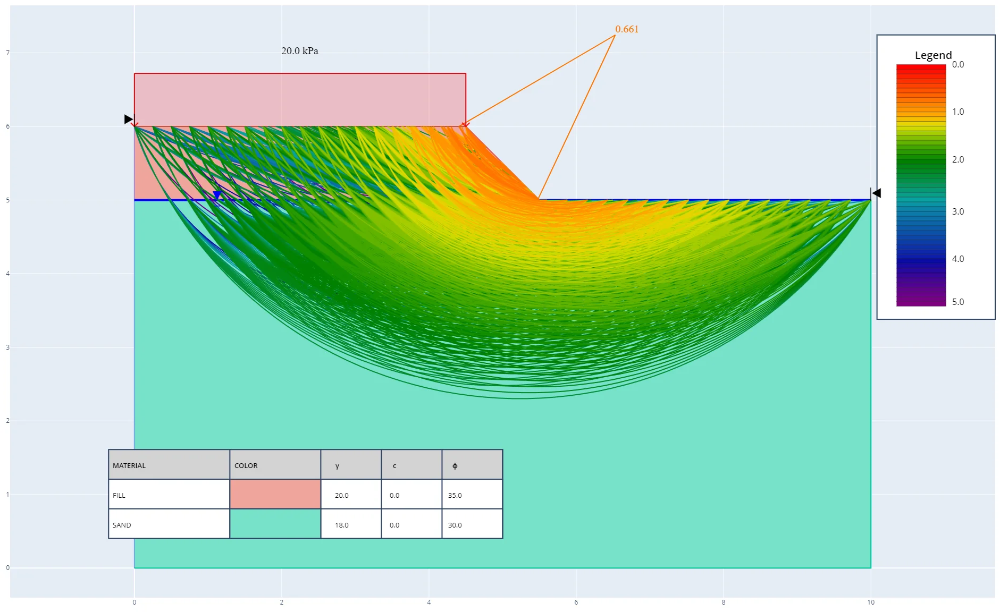

# 🌍 Landslide Detection & Slope Calculation System 🚨

This project is part of the solution to the Air Selangor Data & Digital Hackathon 2024​ by Team H2OByte

Welcome to the **Landslide Detection & Slope Calculation System**! This project is a Python-based solution designed to calculate the **sloppiness** of land and detect potential **landslides**. Utilizing the powerful **PySlope** library, this tool offers an API to interactively query and receive real-time results for geographical terrain analysis.

---

## 📖 **Project Overview**

This system calculates the slope of land and analyzes the probability of a landslide occurrence based on the data provided. It helps in early detection of landslide-prone areas, preventing potential disasters.

### ✨ **Key Features**:

- **Slope Calculation**: Automatically computes the sloppiness of any given terrain.
- **Landslide Detection**: Predicts the risk of landslides using slope analysis.
- **API Access**: Provides results via a simple and efficient API interface.

---

## 🛠 **Tech Stack**

- **Language**: Python 🐍
- **Library**: PySlope 📏
- **API Framework**: FastAPI ⚡

---

## ⚙️ **Installation**

Follow the steps below to set up the project on your local machine:

### Prerequisites:

- Python 3.8 or higher
- Pip

```bash
# Clone the repository
git clone https://github.com/csrong99/land-slope-monitoring.git

# Navigate to the project directory
cd land-slope-monitoring

# Install dependencies
pip install -r requirements.txt
```

---

## 🚀 **Usage**

Once the installation is complete, you can start using the system to calculate slope and detect landslides.

### Running the Python Script:

```bash
python main.py
```


The API will be available at `http://127.0.0.1:8000`.

---

## 📝 **API Documentation**

### **Endpoint**: `/slope-graph/`

**Method**: `POST`

**Description**: Calculate the slope and check for landslide probability.

#### Request Body:
```json
{
    "slope_height": 25.0,
    "slope_len": 100.0,
    "water_depth": 5.0,
    "geology": [
        {
            "soil_name": "Clay",
            "layer_thick": 10.0,
            "unit_weight": 18.0,
            "friction_angle": 28.5,
            "effective_cohesion": 5.0
        },
        {
            "soil_name": "Sand",
            "layer_thick": 15.0,
            "unit_weight": 16.5,
            "friction_angle": 32.0,
            "effective_cohesion": 3.0
        }
    ],
    "udl": [
        {
            "magnitude": 12.0,
            "offset_from_crest": 5.0,
            "load_len": 20.0
        }
    ],
    "point_load": [
        {
            "magnitude": 8.0,
            "offset_from_crest": 3.0
        }
    ]
}
```

- **slope_height**, **slope_len**, and **water_depth** are numeric values representing the dimensions of the land and water depth.
- **geology** is a list of GeologyModel objects, where each object has fields such as **soil_name**, **layer_thick**, **unit_weight**, **friction_angle**, and **effective_cohesion**.
- **udl** is a list of UdlModel objects, each containing **magnitude**, **offset_from_crest**, and **load_len**.
- **point_load** is a list of PointLoadModel objects, each containing **magnitude** and **offset_from_crest**.


#### Response:


---

## ✨ **Acknowledgements**

- **PySlope** for providing a powerful terrain analysis toolkit.
- **FastAPI** for the amazing API framework.

